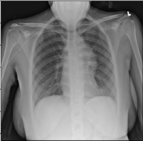

# Chest-X-Ray-Medical-Diagnosis-with-Deep-Learning
Diagnose 14 abnormalities on Chest X-Ray using Deep Learning. Perform diagnostic interpretation using GradCAM Method

# Project Description
This project is a complilation of several sub-projects from Coursera 3-course [IA for Medical Specialization](https://www.coursera.org/specializations/ai-for-medicine). The objective is to use a deep learning model to diagnose pathologies from Chest X-Rays.

The project uses a pretrained DenseNet-121 model able to diagnose 14 labels such as Cardiomegaly, Mass, Pneumothorax or Edema. In other words, this single model can provide binary classification predictions for each of the 14 labeled pathologies.

Weight normalization is performed to offset the low prevalence of the abnormalities among the dataset of X-Rays (class imbalance).

Finally the GradCAM technique is used to highlight and visualize where the model is looking, which area of interest is used to make the prediction. This is a tool which can be helpful for discovery of markers, error analysis, and even in deployment.

# Dataset

The project uses chest x-ray images taken from the public [ChestX-ray8 dataset](https://arxiv.org/abs/1705.02315). This dataset contains 108,948 frontal-view X-ray images of 32,717 unique patients. Each image in the data set contains multiple text-mined labels identifying 14 different pathological conditions.
These in turn can be used by physicians to diagnose 8 different diseases.
For the project we have been working with a ~1000 image subset of the images.
- 875 images to be used for training.
- 109 images to be used for validation.
- 420 images to be used for testing.

The dataset includes a CSV file that provides the ground truth labels for each X-ray.

# DenseNet highlights
320x320
!

# Environment and dependencies
In order to run the model, I used an environment with tensorflow 1.15.0 and Keras 2.1.6.

# Results
I used a pre-trained model which performance can be evaluated using the ROC curve shown at the bottom. The best results are achieved for Cardiomegaly (0.9 AUC), Edema (0.86) and Mass (0.82). Ideally we want to be significantly closer to 1.

Looking at unseen X-Rays, the model correctly predicts the predominant abnormality, generating a somehow accurate diagnotic, highlighting accurately the key region of interest. In addition to its main diagnostic, the model also predicts secondary issues similarly to what a radiologist would comment as part of his analysis. 

The model correctly predicts Cardiomegaly and absence of mass or edema. The probability for mass is higher, and we can see that it may be influenced by the shapes in the middle of the chest cavity, as well as around the shoulder.

The model picks up the mass near the center of the chest cavity on the right. Edema has a high score for this image, though the ground truth doesn't mention it.

Here the model correctly picks up the signs of edema near the bottom of the chest cavity. We can also notice that Cardiomegaly has a high score for this image, though the ground truth doesn't include it. This visualization might be helpful for error analysis; for example, we can notice that the model is indeed looking at the expected area to make the prediction.

